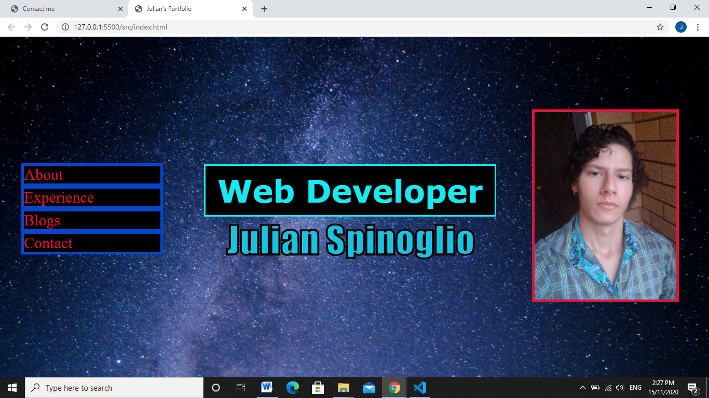
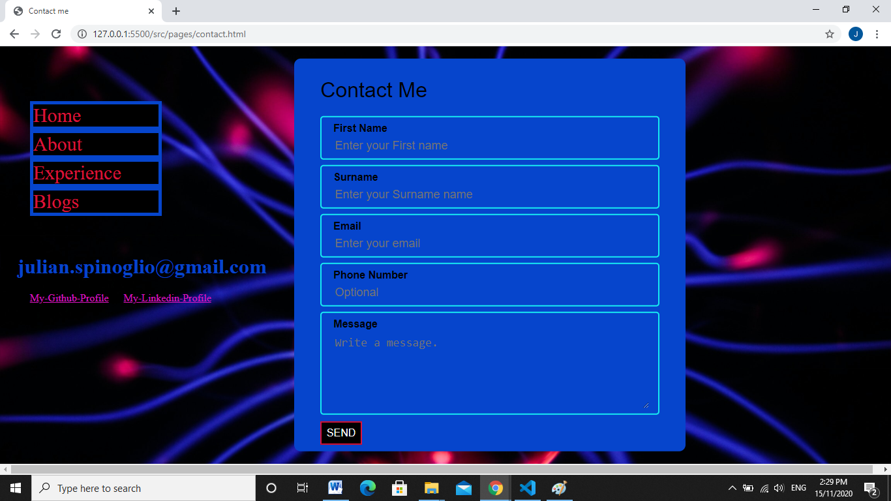
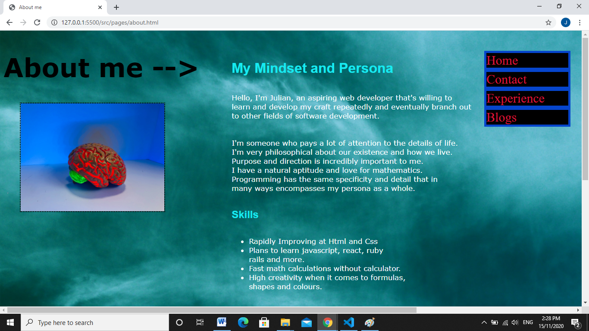
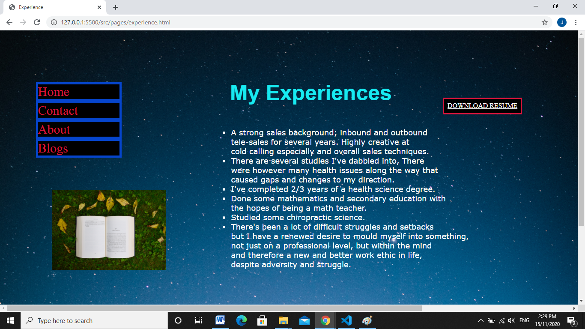
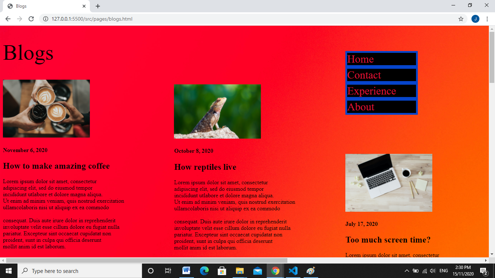
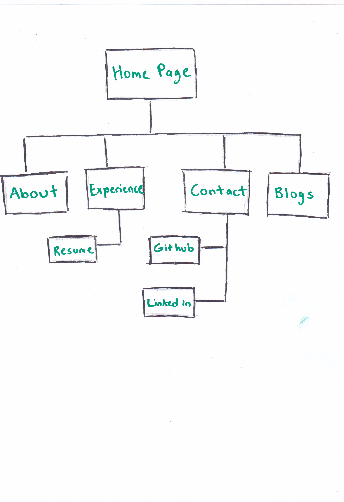
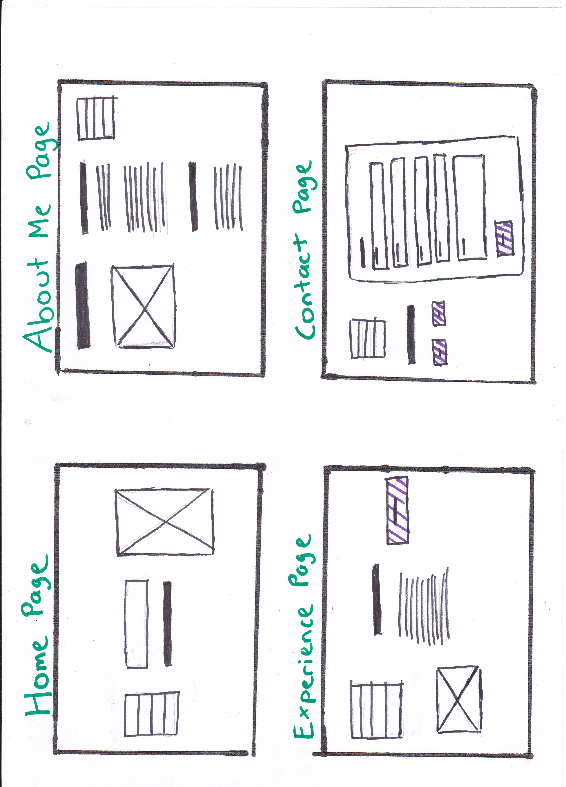
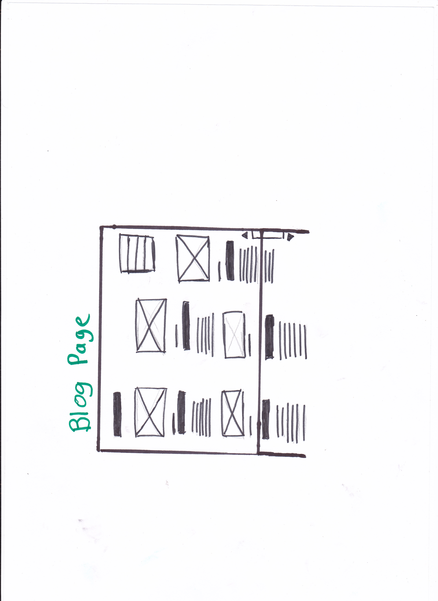
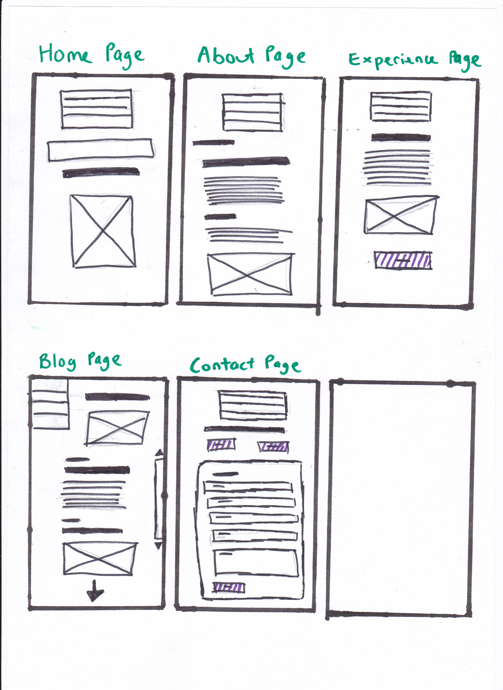

***Note for the marker***

Before looking at my deployed portfolio,
in the docs folder, I have a folder called "Screenshots." 
In that folder are my website screenshots based on my personal laptop resolution (1366 x 768.) I have messed up responsive design. This is just to show that the website has the ability to look pleasing to the eye on desktop, given that resolution. So in short, responsive design was not acheived, but it does look nice at the mentioned resolution. (Included the screenshots below)

**Published portfolio website**

[Julians Portfolio](https://zealous-snyder-c602a7.netlify.app)

**Git hub repo link**

[Julians Gitgub Respository](https://github.com/julianneedstocode950/Julians-First-Portfolio)

**Purpose**

The purpose of creating this website is firstly to increase my skill level and knowledge base of code when it comes to making a website. The second purpose is to practise how I would prove my skills to an employer. This is a fundamental skill for future employment. Thirdly, to develop the skills outside of coding that involve structure and layout so that others can view my work/code with clarity and more understanding.

**Functionality/Features**

So the website comes with a fully functional vertical navigation bar that allows you to switch between five different html pages; Home, about, experience, contact and blogs. There are outside links to github, linked in and my resume that open on separate browsers. There is a form on the contacts page that the user can fill out. Every page has images related to several different paragraphs and these paragraphs have content which relate to the brief of the assesment. There are heading to determine what each paragraph will be about.

The website uses a fleuroescent blue colour and crimson to stand out from darker background colours. The paragraphs of text also use colours such as white to contrast against dark backgrounds. Responsive design unfortunately is not complete and the website only flows well with a screen resolution of 1366 x 768 which is the equivalent of my laptop screen resolution. Anything much bigger or much smaller than that screen resolution will begin to distort.

# Screen shots of website at 1366 x 768 resolution

## sitemap

## Wireframes

